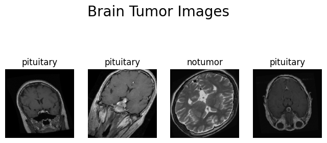
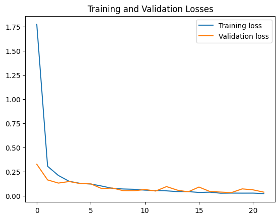
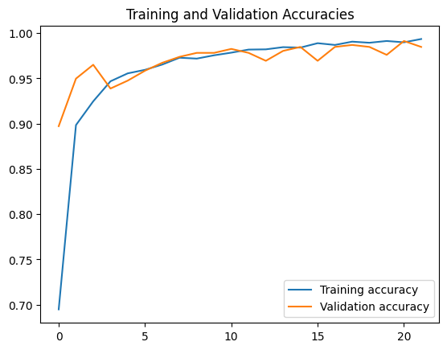
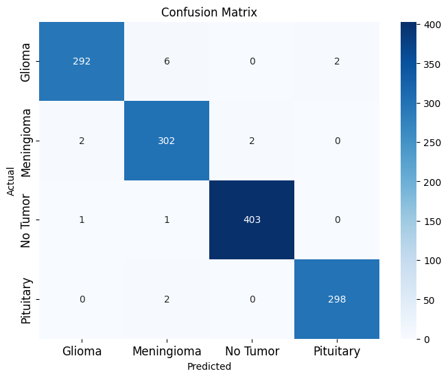
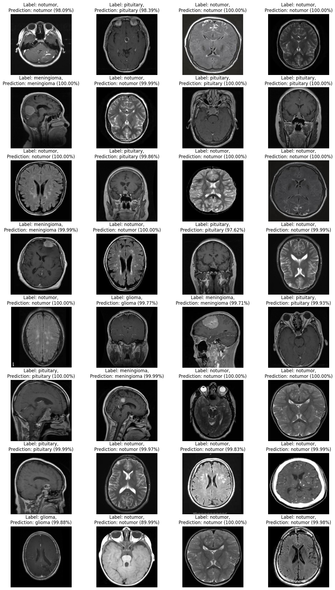

# Brain-tumor-classification
## Summary 
Brain tumors, which affect both children and adults, are highly aggressive diseases, constituting the majority of primary Central Nervous System (CNS) tumors. Annually, approximately 11,700 individuals are diagnosed with brain tumors, with a 5-year survival rate of around 34% for men and 36% for women. These tumors are categorized as benign, malignant, pituitary, and others. To enhance patient life expectancy, it is imperative to employ precise diagnostics and treatment planning. Magnetic Resonance Imaging (MRI) is the preferred method for brain tumor detection, generating substantial image data that must be evaluated by radiologists. Manual examination can be prone to errors due to the intricacies of brain tumors.  
  
The application of automated classification techniques, including Machine Learning (ML) and Artificial Intelligence (AI), consistently outperforms manual classification. Therefore, proposing a system that utilizes Deep Learning Algorithms like Convolutional Neural Networks (CNN), Artificial Neural Networks (ANN), and Transfer Learning (TL) could greatly assist medical professionals worldwide.  
  
In a context where brain tumors exhibit diverse sizes and locations, making their nature challenging to understand, MRI analysis typically necessitates a skilled neurosurgeon. Developing countries often face a shortage of qualified doctors and limited knowledge about tumors, resulting in time-consuming and challenging MRI report generation. Hence, implementing an automated system can address these challenges.   
  
The dataset used was the Brain Tumor Classification Dataset from Kaggle, which can be found [here](https://www.kaggle.com/sartajbhuvaji/brain-tumor-classification-mri).

## Tools
In the make of this studies the following tools were used:  
- Python v3.11
- Numpy
- Matplolib
- Pytorch
- Scikit-learn
- Tqdm

## Analysis, model and classification
### Augmented data
Data augmentation is a technique that is used to artificially expand the size of a training dataset by creating modified versions of images in the dataset. It is a regularization technique that makes the model more robust to slight variations in the training data.
The following transformations were applied to the images:
- Resize to 256x256
- Random horizontal flip
- Random vertical flip
- Random rotation
- Random affine
- Color jitter

### Model
The model used was a EfficientNet-B0, a convolutional neural network architecture that achieved the state-of-the-art accuracy with an order of magnitude of fewer parameters and FLOPS, on both ImageNet and five other commonly used transfer learning datasets. Here was used transfer learning with the ImageNet weights and after was trained with the following parameters:  
  
- Epochs: 100
- Batch size: 32
- Learning rate: 0.0001
- Optimizer: Adam
- Loss function: CrossEntropyLoss  
  
Besides that an earlystopping method was used to avoid overfitting.  

### Training

The following losses and accuracies were obtained during the training:

### Results
The following confusion matrix was obtained:

Some of the classification results:

## Conclusion
- Test acc: 0.9878
- Test F1 Score: 0.9878
- Test Precision: 0.9879
- Test Recall: 0.9878  

Classification Report:
| Tumor | Precision | Recall | F1-Score | Support |
| ----------- | ----------- | ----------- | ----------- | ----------- |
| Glioma      | 0.99 | 0.97 | 0.98 | 300 |
| Meningioma  | 0.97 | 0.99 | 0.98 | 306 |
| No tumor    | 1.00 | 1.00 | 1.00 | 405 |
| Pituitary   | 0.99 | 0.99 | 0.99 | 300 |